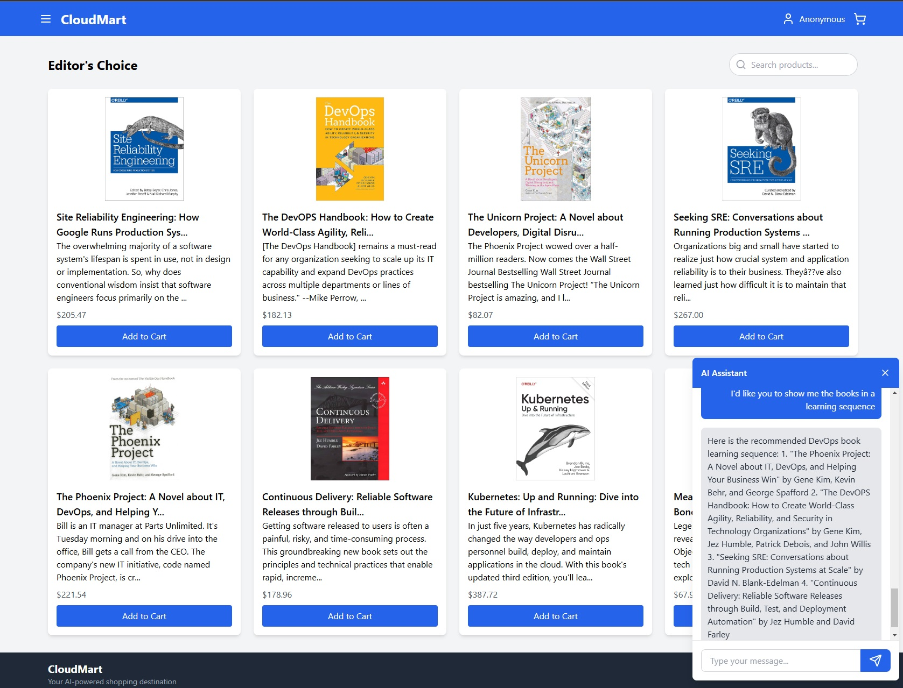

  
  <h1>CloudMart AI</h1>
  
Autonomous Multi-Cloud E-Commerce Platform with AI Integration

  
<b>AWS | Azure | Google Cloud | Terraform | Kubernetes | React | Docker</b>

<h2>📋 Table of Contents</h2>
<ul>
  <li><a href="#overview">Overview</a></li>
  <li><a href="#architecture">Architecture</a></li>
  <li><a href="#service-architecture">Service Architecture</a></li>
  <li><a href="#technology-stack">Technology Stack</a></li>
  <li><a href="#key-features">Key Features</a></li>
  <li><a href="#getting-started">Getting Started</a></li>
  <li><a href="#project-structure">Project Structure</a></li>
  <li><a href="#images">Images</a></li>
  <li><a href="#api-examples">API Examples</a></li>
  <li><a href="#future-enhancements">Future Enhancements</a></li>
  <li><a href="#contributing">Contributing</a></li>
  <li><a href="#license">License</a></li>
</ul>

<h2 id="overview">🌐 Overview</h2>

<b>CloudMart AI</b> is a modern, multi-cloud e-commerce platform built with a microservices architecture and cutting-edge AI technologies. It provides autonomous customer support, intelligent product recommendations, and real-time analytics by leveraging the best services from AWS, Azure, and Google Cloud.

The platform includes:

<ul>
  <li>Autonomous AI-driven customer support chatbot powered by Amazon Bedrock (ClaudeAI 3.7) and OpenAI.</li>
  <li>Multi-cloud infrastructure provisioned using Infrastructure as Code (IaC) principles with Terraform.</li>
  <li>Containerized microservices architecture managed via Kubernetes (AWS EKS).</li>
  <li>Cross-cloud data synchronization and analytics with DynamoDB Streams integrated into Google BigQuery.</li>
  <li>Automated CI/CD pipelines using GitHub Actions, AWS CodePipeline, and AWS CodeBuild.</li>
</ul>

<h2 id="architecture">🏗️ Kubernetes Architecture</h2>

<table border="1" cellspacing="0" cellpadding="5">
  <tr>
    <th>Component</th>
    <th>Description</th>
  </tr>
  <tr>
    <td><b>Frontend</b></td>
    <td>React-based UI deployed on Kubernetes (AWS EKS).</td>
  </tr>
  <tr>
    <td><b>Backend API</b></td>
    <td>Node.js microservices handling business logic and database interactions.</td>
  </tr>
  <tr>
    <td><b>AI Services</b></td>
    <td>Amazon Bedrock (ClaudeAI 3.7) & OpenAI for autonomous customer interactions.</td>
  </tr>
  <tr>
    <td><b>Data Layer</b></td>
    <td>DynamoDB for operational data storage synchronized with Google BigQuery for advanced analytics.</td>
  </tr>
  <tr>
    <td><b>Cross-cloud Integration</b></td>
    <td>AWS Lambda functions for real-time data synchronization across cloud providers.</td>
  </tr>
</table>

<h2 id="service-architecture">🗺️ Service Architecture</h2>

  

The service architecture of CloudMart AI showcases a highly scalable, multi-cloud design that integrates advanced AI services, real-time analytics, and event-driven microservices. Below are the key components and their roles:

<ul>
  <li><b>Amazon EKS Cluster:</b> Manages containerized microservices, including `cloudmart-frontend` (user interface) and `cloudmart-backend` (business logic).</li>
  <li><b>Infrastructure as Code (IaC):</b> Terraform automates the provisioning of cloud resources, ensuring consistency and scalability.</li>
  <li><b>CI/CD Pipeline:</b> A fully automated pipeline using GitHub, AWS CodePipeline, CodeBuild, and CodeDeploy enables continuous integration and deployment.</li>
  <li><b>AI Services for Customer Support:</b> Amazon Bedrock (ClaudeAI) and OpenAI provide intelligent recommendations and autonomous customer assistance.</li>
  <li><b>AI Services for Sentiment Analysis:</b> Azure Text Analytics evaluates customer interactions to improve user experience.</li>
  <li><b>Data Layer:</b> Amazon DynamoDB serves as the primary data store for operational data. Real-time streams are processed and sent to Google BigQuery for advanced analytics.</li>
  <li><b>Event-Driven Microservices:</b> AWS Lambda functions handle real-time data processing and synchronization across services.</li>
  <li><b>Multi-Cloud API:</b> Facilitates seamless integration between AWS, Azure, and Google Cloud services, ensuring interoperability across platforms.</li>
</ul>

<h2 id="technology-stack">🛠️ Technology Stack</h2>

<h3>Infrastructure & Deployment</h3>
<table border="1" cellspacing="0" cellpadding="5">
  <tr>
    <th>Technology</th>
    <th>Purpose & Usage</th>
  </tr>
  <tr>
    <td>Terraform</td>
    <td>Infrastructure as Code for provisioning multi-cloud resources.</td>
  </tr>
  <tr>
    <td>Kubernetes (AWS EKS)</td>
    <td>Container orchestration and management of microservices.</td>
  </tr>
  <tr>
    <td>Docker</td>
    <td>Containerization of frontend/backend applications.</td>
  </tr>
  <tr>
    <td>Amazon ECR</td>
    <td>Secure Docker image storage integrated into CI/CD pipeline.</td>
  </tr>
  <tr>
    <td>GitHub Actions & AWS CodePipeline/CodeBuild</td>
    <td>Automated CI/CD pipeline for continuous integration and deployment.</td>
  </tr>
  <tr>
    <td>OIDC Authentication</td>
    <td>Secure authentication between cloud services using OpenID Connect.</td>
  </tr>
</table>

<h3>Backend & AI Services</h3>
<table border="1" cellspacing="0" cellpadding="5">
  <tr>
    <th>Technology</th>
    <th>Purpose & Usage</th>
  </tr>
  <tr>
    <td>AWS Lambda</td>
    <td>Serverless functions for rapid product listings and data processing.</td>
  </tr>
  <tr>
    <td>Amazon DynamoDB</td>
    <td>Scalable NoSQL database for products, orders, and support tickets.</td>
  </tr>
  <tr>
    <td>Amazon Bedrock (ClaudeAI 3.7)</td>
    <td>Autonomous AI agent providing intelligent product recommendations directly integrated into the e-commerce platform.</td>
  </tr>
  <tr>
    <td>OpenAI API</td>
    <td>Autonomous customer support chatbot integrated via API.</td>
  </tr>
</table>

<h3>Analytics & Intelligence</h3>
<table border="1" cellspacing="0" cellpadding="5">
  <tr>
    <th>Technology</th>
    <th>Purpose & Usage</th>
  </tr>
  <tr>
    <td>Google BigQuery</td>
    <td>Advanced analytics platform generating strategic insights from operational data streams.</td>
  </tr>
  <tr>
    <td>Azure AI Text Analytics</td>
    <td>Autonomous sentiment analysis of customer interactions to ensure high-quality support.</td>
  </tr>
</table>

<h2 id="key-features">🌟 Key Features</h2>

<h3>Multi-Cloud Strategy</h3>

Leveraging the strengths of each cloud provider:

<table border="1" cellspacing="0" cellpadding="5">
  <tr>
    <th>AWS</th>
    <th>Azure</th>
    <th>Google Cloud</th>
  </tr>
  <tr>
    <td>EKS (Kubernetes)</td>
    <td>Text Analytics</td>
    <td>BigQuery</td>
  </tr>
  <tr>
    <td>Lambda Functions</td>
    <td></td>
    <td></td>
  </tr>
  <tr>
    <td>DynamoDB</td>
    <td></td>
    <td></td>
  </tr>
  <tr>
    <td>Bedrock (ClaudeAI 3.7)</td>
    <td></td>
    <td></td>
  </tr>
  <tr>
    <td>ECR</td>
    <td></td>
    <td></td>
  </tr>
  <tr>
    <td>CodePipeline & CodeBuild</td>
    <td></td>
    <td></td>
  </tr>
</table>

<h3>🤖 AI-Powered Customer Experience</h3>
<ul>
  <li>Intelligent product recommendations via Amazon Bedrock.</li>
  <li>Autonomous customer support chatbot powered by OpenAI.</li>
  <li>Automatic sentiment analysis of customer interactions using Azure Text Analytics.</li>
</ul>

<h3>⚙️ DevOps Excellence</h3>
<ul>
  <li>Infrastructure as Code (Terraform).</li>
  <li>Containerized deployments orchestrated by Kubernetes.</li>
  <li>Fully automated CI/CD pipelines with GitHub Actions, AWS CodePipeline, and AWS CodeBuild.</li>
  <li>Secure multi-cloud authentication via OIDC.</li>
</ul>

<h2 id="getting-started">🚀 Getting Started</h2>

<h3>Prerequisites</h3>

Ensure you have these installed and configured:

<ul>
  <li>AWS CLI configured with appropriate permissions</li>
  <li>Terraform CLI installed</li>
  <li>Docker installed</li>
  <li>kubectl installed</li>
  <li>Access credentials for AWS, Azure, and GCP accounts</li>
</ul>

<h3>Deployment Steps</h3>

<ol>
  <li>Clone the repository:
    <pre><code>git clone https://github.com/yourusername/cloudmart-ai.git
cd cloudmart-ai</code></pre>
  </li>
  <li>Configure cloud provider credentials:
    
Set up access credentials for AWS, Azure, and GCP.

  </li>
  <li>Provision infrastructure with Terraform:
    <pre><code>cd terraform-project
terraform init
terraform plan
terraform apply</code></pre>
  </li>
  <li>Deploy applications to Kubernetes:
    <pre><code>aws eks update-kubeconfig --name cloudmart --region us-east-1
kubectl apply -f cloudmart-backend.yaml
kubectl apply -f cloudmart-frontend.yaml</code></pre>
  </li>
  <li>Configure AI services:
    

      
Detailed Amazon Bedrock Configuration

      <ol>
        <li>Access the AWS Bedrock console.</li>
        <li>Configure ClaudeAI 3.7 model.</li>
        <li>Create an agent for product recommendations.</li>
        <li>Connect agent to DynamoDB product database.</li>
        <li>Deploy agent and obtain API endpoint.</li>
      </ol>
    

  </li>
</ol>

<h2 id="project-structure">📁 Project Structure</h2>

<pre><code>cloudmart-ai/
├── terraform-project/           # Infrastructure as Code (Terraform scripts)
├── challenge-day2/
│   ├── backend/                 # Backend API service
│   │   ├── src/                 # Source code (Node.js)
│   │   ├── Dockerfile           # Backend container definition
│   │   └── cloudmart-backend.yaml # Kubernetes manifest backend
│   └── frontend/                # Frontend application (React)
│       ├── src/                 # Source code
│       ├── Dockerfile           # Frontend container definition
│       └── cloudmart-frontend.yaml # Kubernetes manifest frontend
├── cloud-codes/
│   ├── buildspec.yml            # Build specifications for CI/CD pipeline
│   └── deployspec.yml           # Deployment specifications for CI/CD pipeline
└── README.md                    # Project documentation (this file)</code></pre>

<h2 id="images">📸 Images</h2>

<h3>AWS CodePipeline / CodeBuild CI/CD</h3>

Successful execution of our CI/CD pipeline with source, build, and deploy stages:

<h3>CloudMart Products Page</h3>

Our e-commerce platform's main product listing page:

<h3>AI-Powered Product Recommendations</h3>

Intelligent product recommendations powered by Amazon Bedrock (ClaudeAI 3.7):

<h3>AI-Powered Customer Support</h3>

Intelligent product recommendations powered by Amazon Bedrock (OpenAI API):

<h3>Support Tickets Sentiment Analysis</h3>

 The sentiment analysis of support tickets. Each ticket is categorized as <strong>negative</strong>, <strong>positive</strong>, or <strong>neutral</strong>, based on the emotional tone of the customer's interaction. This analysis helps prioritize responses and improve customer support strategies.

<h3>DynamoDB to BigQuery Integration</h3>

Real-time data streaming from AWS DynamoDB to Google BigQuery:

<h2 id="api-examples">📊 API Examples</h2>

<pre><code>// Example: Fetching product recommendations from API endpoint

const response = await fetch('/api/recommendations', {
  method: 'POST',
  body: JSON.stringify({ userId: '12345', productId: '67890' }),
  headers: { 'Content-Type': 'application/json' }
});

const recommendations = await response.json();</code></pre>

<h2 id="future-enhancements">🔮 Future Enhancements</h2>

Upcoming features include:

<ul>
  <li>Enhanced AI recommendation engine leveraging detailed customer browsing history.</li>
  <li>Real-time analytics dashboards for advanced business intelligence.</li>
  <li>Mobile application integrating existing AI capabilities.</li>
  <li>Expanded multi-cloud resilience with cross-region failover mechanisms.</li>
</ul>

<h2 id="contributing">🤝 Contributing</h2>

Contributions are welcome! Please open issues or submit pull requests to help improve CloudMart AI.

See our <a href="CONTRIBUTING.md">CONTRIBUTING.md</a> file for contribution guidelines.

<h2 id="license">📜 License</h2>

This project is licensed under the MIT License – see the <a href="LICENSE">LICENSE</a> file for details.

  
Built with ❤️ using AWS, Azure, GCP, and cutting-edge AI technologies

  
<i>Last updated: March 14th, 2025</i>

